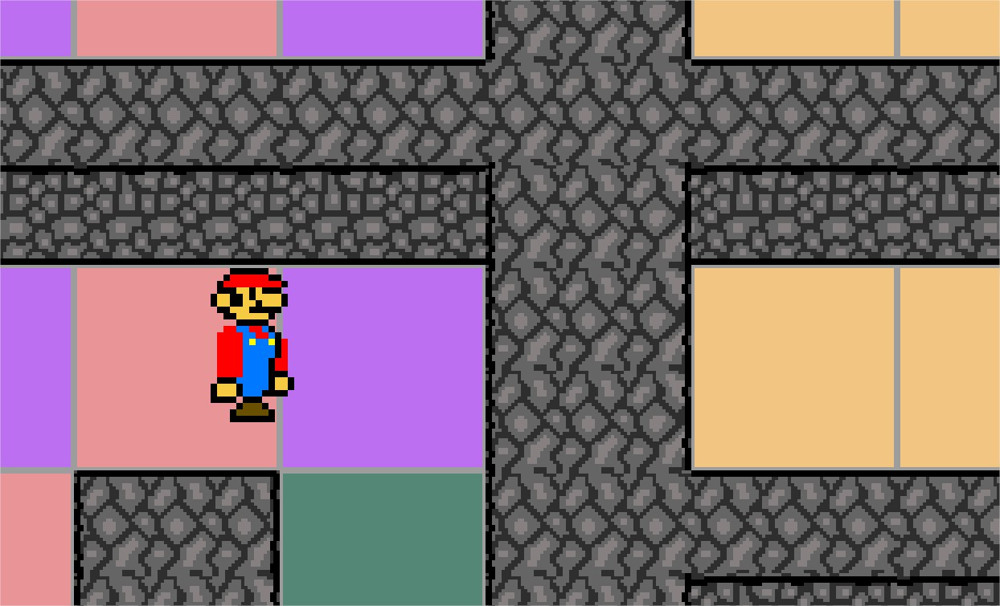

Use the arrow keys to move the character.

Source code is located in Testing directory. 

##### Windows

Open Testing.sln with Microsoft Visual Studio and compile.

##### OS X:

Compile v1.0:
g++ -o main -lglfw -lglew -framewoenGL main.cpp Engine.cpp utils/SquareProperties.cpp utils/Input.cpp utils/Shader.cpp -Iinclude -std=c++2a

Compile v1.01:
g++ -o main -lglfw -lglew -framework OpenGL main.cpp Engine.cpp utils/SquareProperties.cpp utils/Input.cpp utils/Shader.cpp utils/TextureAsset.cpp utils/TextureUtils.cpp DrawingObject.cpp Texture.cpp -Iinclude -std=c++2a

Compile v1.02:
g++ -o main -lglfw -lglew -framework OpenGL main.cpp Engine.cpp utils/SquareProperties.cpp utils/Input.cpp utils/Shader.cpp utils/TextureAsset.cpp utils/TextureUtils.cpp DrawingObject.cpp Texture.cpp camera/Camera.cpp -Iinclude -std=c++2a

Compile v1.03:
g++ -o main -lglfw -lglew -framework OpenGL main.cpp Engine.cpp utils/SquareProperties.cpp utils/Input.cpp utils/Shader.cpp utils/TextureAsset.cpp utils/TextureUtils.cpp DrawingObject.cpp Texture.cpp camera/Camera.cpp drawings/PlatformsDrawingObject.cpp drawings/WallsDrawingObject.cpp -Iinclude -std=c++2a

Compile v1.04:
g++ -o main -lglfw -lglew -framework OpenGL main.cpp engine/Engine.cpp utils/SquareProperties.cpp input/Input.cpp shader/Shader.cpp texture/TextureAsset.cpp texture/TextureUtils.cpp drawings/DrawingObject.cpp texture/Texture.cpp camera/Camera.cpp drawings/PlatformsDrawingObject.cpp drawings/WallsDrawingObject.cpp -Iinclude -std=c++2a

Compile v1.05:
g++ -o main -lglfw -lglew -framework OpenGL main.cpp engine/Engine.cpp utils/SquareProperties.cpp input/Input.cpp shader/Shader.cpp texture/TextureAsset.cpp texture/TextureUtils.cpp drawings/DrawingObject.cpp texture/Texture.cpp camera/Camera.cpp drawings/PlatformsDrawingObject.cpp drawings/WallsDrawingObject.cpp drawings/SpriteDrawingObject.cpp -Iinclude -std=c++2a

Compile v1.06:
g++ -o main -lglfw -lglew -framework OpenGL main.cpp engine/Engine.cpp utils/SquareProperties.cpp input/Input.cpp shader/Shader.cpp texture/TextureAsset.cpp texture/TextureUtils.cpp drawings/DrawingObject.cpp texture/Texture.cpp camera/Camera.cpp drawings/PlatformsDrawingObject.cpp drawings/WallsDrawingObject.cpp drawings/SpriteDrawingObject.cpp character/Character.cpp -Iinclude -std=c++2a

Compile v1.07:
g++ -o main -lglfw -lglew -framework OpenGL main.cpp engine/Engine.cpp utils/SquareProperties.cpp input/Input.cpp shader/Shader.cpp texture/TextureAsset.cpp texture/TextureUtils.cpp drawings/DrawingObject.cpp texture/Texture.cpp camera/Camera.cpp drawings/PlatformsDrawingObject.cpp drawings/WallsDrawingObject.cpp drawings/SpriteDrawingObject.cpp drawings/ShadowDrawingObject.cpp character/Character.cpp -Iinclude -std=c++2a

Execute:
./main
